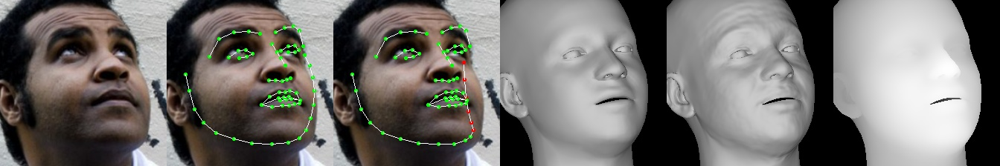
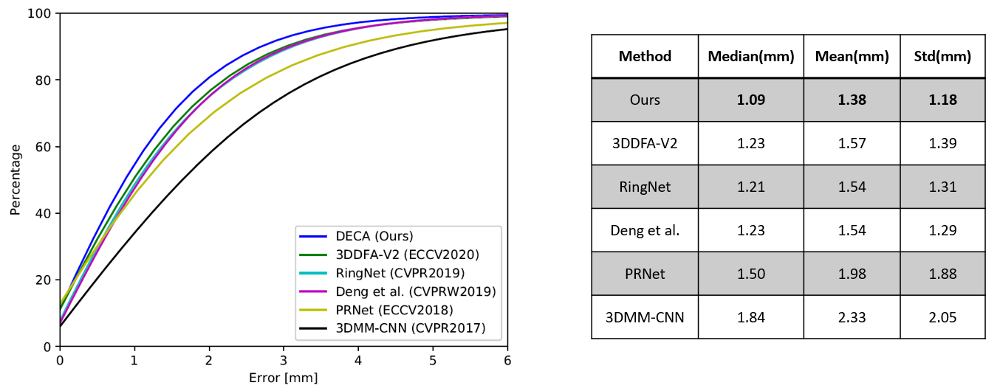

# DECA: Detailed Expression Capture and Animation

<p align="center"> 

</p>
<p align="center">input image, aligned reconstruction, animation with various poses & expressions<p align="center">

This is the official Pytorch implementation of DECA. 

DECA reconstructs a 3D head model with detailed facial geometry from a single input image. The resulting 3D head model can be easily animated. Please refer to the [arXiv paper](https://arxiv.org/abs/2012.04012) for more details.

The main features:

* **Reconstruction:** produces head pose, shape, detailed face geometry, and lighting information from a single image.
* **Animation:** animate the face with realistic wrinkle deformations.
* **Robustness:** tested on facial images in unconstrained conditions.  Our method is robust to various poses, illuminations and occlusions. 
* **Accurate:** state-of-the-art 3D face shape reconstruction on the [NoW Challenge](https://ringnet.is.tue.mpg.de/challenge) benchmark dataset.

## Getting Started
Clone the repo:
  ```bash
  git clone https://github.com/YadiraF/DECA
  cd DECA
  ```  

### Requirements
* Python 3.7 (numpy, skimage, scipy, opencv)  
* PyTorch >= 1.6 (pytorch3d)  
* face-alignment (Optional for detecting face)  
  You can run 
  ```bash
  pip install -r requirements.txt
  ```
  Or use virtual environment by runing 
  ```bash
  bash install_pip.sh
  ```
  Then follow the instruction to install [pytorch3d](https://github.com/facebookresearch/pytorch3d/blob/master/INSTALL.md).

### Usage
1. Prepare data   
    a. download [FLAME model](https://flame.is.tue.mpg.de/downloads), choose **FLAME 2020** and unzip it, copy 'generic_model.pkl' into ./data  
    b. download [DECA trained model](https://drive.google.com/file/d/1rp8kdyLPvErw2dTmqtjISRVvQLj6Yzje/view?usp=sharing), and put it in ./data   
    c. (Optional) follow the instructions for the [Albedo model](https://github.com/TimoBolkart/BFM_to_FLAME) to get 'FLAME_albedo_from_BFM.npz', put it into ./data

2. Run demos  
    a. **reconstruction**  
    ```bash
    python demos/demo_reconstruct.py -i TestSamples/examples --saveDepth True --saveObj True
    ```   
    to visualize the predicted 2D landmanks, 3D landmarks (red means non-visible points), coarse geometry, detailed geoemtry, and depth.   
    <p align="center">   
    
    </p>  
    You can also generate an obj file (which can be opened with Meshlab) that includes extracted texture from the input image.  

    Please run `python demos/demo_reconstruct.py --help` for more details. 

    b. **expression transfer**   
    ```bash
    python demos/demo_transfer.py
    ```   
    c. for the [teaser gif](https://github.com/YadiraF/DECA/results/teaser.gif) (**reposing** and **animation**)
    ```bash
    python demos/demo_teaser.py 
    ``` 
    
    More demos and training code coming soon.

## Evaluation
DECA (ours) achieves 9% lower mean shape reconstruction error on the [NoW Challenge](https://ringnet.is.tue.mpg.de/challenge) dataset compared to the previous state-of-the-art method.  
The left figure compares the cumulative error of our approach and other recent methods (RingNet and Deng et al. have nearly identitical performance, so their curves overlap each other). Here we use point-to-surface distance as the error metric, following the NoW Challenge.  
<p align="left"> 

</p>

For more details of the evaluation, please check our [arXiv paper](https://arxiv.org/abs/2012.04012). 

## Citation
If you find our work useful to your research, please consider citing:
```
@inproceedings{deca2020,
  title={Learning an Animatable Detailed {3D} Face Model from In-The-Wild Images},
  author={Feng, Yao and Feng, Haiwen and Black, Michael J. and Bolkart, Timo},
  booktitle = {arxiv},
  month = {Dec},
  year = {2020}
}
```

<!-- ## Notes
1. Training code will also be released in the future. -->

## License
This code and model are available for non-commercial scientific research purposes as defined in the [LICENSE](https://github.com/YadiraF/DECA/blob/master/LICENSE) file.
By downloading and using the code and model you agree to the terms in the [LICENSE](https://github.com/YadiraF/DECA/blob/master/LICENSE). 

<!-- ## Acknowledgements -->
